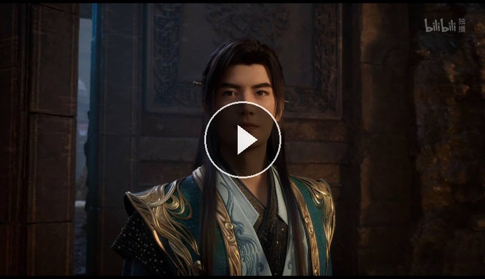

# Lcat — 自用视频补帧工具

基于 [Practical-RIFE](https://github.com/hzwer/Practical-RIFE) PyTorch 架构的视频插帧软件，PyQt5 图形界面。

## 效果展示

  <a href="https://www.bilibili.com/video/BV1R2Jw67EZJ/">
    
     ▶ 点击观看 Bilibili 演示视频
  </a>

## 功能

- 2x/4x/8x 视频补帧
- 10 个 RIFE v4.x 模型（v4.3 ~ v4.26），放入文件夹即自动识别
- 10 种编码格式 (H.264/H.265/AV1 × 软编/NVENC)
- **HDR10 + Dolby Vision 色彩完整保留**
- 音轨/字幕保留，PTS 偏移声画同步
- VFR 可变帧率自动检测 + CFR 预处理
- 场景切换智能检测（阈值可调 + 动漫模式）
- FP16 半精度推理（RTX 20 系以上提速 ~30%）
- 批量处理 + 自动关机
- GPU 自适应推理分辨率
- 拖拽导入、实时进度

## 下载

[▶ 最新版 v2.0.0](https://github.com/superokde/Lcat/releases/tag/v2.0.0)

## 系统要求

- Windows 10/11 64-bit
- NVIDIA GPU (CUDA 驱动) 或 CPU
- 约 10GB 磁盘空间（含模型）

## 使用

1. 下载 Release 页面的 2 个分卷，合并解压
2. 双击 `Lcat/Lcat.exe`
3. 拖入视频 → 选择模型 → 开始补帧
